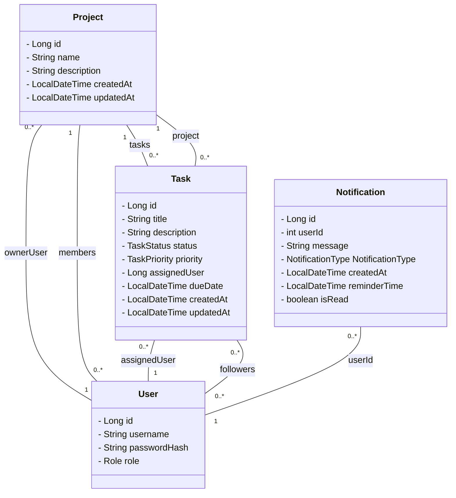
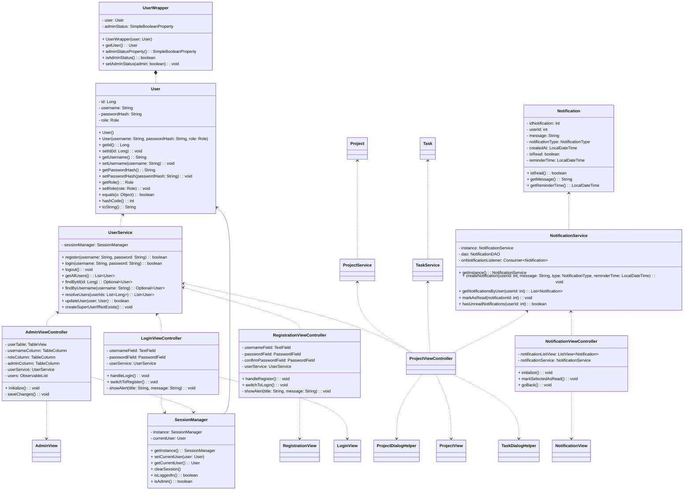

# Meta-relazione per Progettazione e Sviluppo del Software

# Analisi

## Requisiti
Il gruppo si pone come obiettivo la realizzazione di TaskHive, un software pensato per agevolare l’organizzazione dei progetti e la collaborazione tra i membri del team.
Sarà dotata di funzioni che facilitino la pianificazione, l’assegnazione dei compiti e il monitoraggio dell'avanzamento dei progetti.

#### Requisiti funzionali
**Lato utente sono presenti funzionalità di:**
- Login al proprio account (tramite username e password)
    - Le password vengono criptate tramite un algoritmo di hash per motivi di sicurezza, onde evitare di avere password in chiaro all'interno del database

- Registrazione di un nuovo account

- Visualizzazione e funzionalità del progetto variabili in base ai seguenti ruoli:
    - USER: Sola lettura dei progetti di cui è membro
    - ADMIN: Lettura e modifica dei progetti di cui è membro
    - SUPER: Lettura e modifica di tutti i progetti

**Dopo l'accesso viene visualizzata l'interfaccia principale, che offre queste funzionalità:**

- Creazione, modifica ed eliminazione del progetto
- Creazione, modifica ed eliminazione dei task
- Sidebar elenco progetti per selezionare quello da visualizzare
- Visualizzazione dei task tramite Kanban board suddivisa nei 4 stati possibili (PENDING, IN_PROGRESS, COMPLETED, BLOCKED)
- Modifica rapida dello stato del task, trascinandolo da una colonna all'altra della Kanban board
- Gestione priorità dei task (LOW, MEDIUM, HIGH)
- Visualizzazione rapida dei task in scadenza e scaduti tramite il box della data che utilizza i seguenti colori di sfondo:
    - ROSSO: Task scaduto
    - GIALLO: Task in scadenza tra meno di una settimana
    - TRASPARENTE: Task in scadenza tra più di una settimana


**Il sistema di notifiche permette all’utente di:**

- Ricevere una notifica ogni volta che si verifica un evento rilevante nel progetto (es. aggiornamenti, messaggi, assegnazioni di task).

- Visualizzare le notifiche in un’apposita vista ("Notifiche").

- Segnare come lette le notifiche individualmente.

- Visualizzare un indicatore di nuove notifiche (icona a campanella con un dot lampeggiante).

- Aggiornare in tempo reale lo stato di lettura e visibilità delle notifiche.


#### Requisiti non funzionali

Lato utente è presente:
- Accessibile solo al ruolo SUPER, una schermata per la gestione dei permessi (promozione e declassamento da ADMIN)

**Il sistema di notifiche inoltre:** 

- Mostra in modo reattivo le notifiche (UI aggiornata senza bisogno di riavii).
- Il sistema è scalabile, gestisce un numero crescente di notifiche.
- L'interfaccia è chiara ed intuitiva, con feedback visivo immediato nella home(dot lampeggiante).
- L'aggiornamento della UI non blocca il Main Thread.


## Analisi e modello del dominio

Il dominio lato utente si basa su:

- **Utente**: rappresenta una persona fisica che utilizza l'applicazione
- **Gestore Registrazione/Login (UserService)**: gestisce l'inserimento di nuovi utenti e permette di accedere ad utenti già registrati
- **Viste**:
    - **LoginView**: interfaccia per inserimento username e password di un utente già registrato
    - **RegistrationView**: interfaccia per creazione di un nuovo utente
    - **AdminView**: interfaccia accessibile solo ad un utente con ruolo SUPER; permette di aumentare o diminuire i privilegi di altri utenti

Il dominio della funzionalità "Notifiche" comprende i seguenti concetti principali:

- **Notifica**: rappresenta un messaggio di preavviso o di informazione da mostrare all'utente.
- **Gestore delle notifiche (NotificationService)**: componente che mantiene lo stato delle notifiche e notifica la UI in caso di cambiamenti.
- **Vista Notifiche (NotificationView)**: interfaccia grafica per la visualizzazione e gestione delle notifiche.
- **Notification Indicator**: elemento grafico che segnala la presenza di notifiche non lette.




# Design


## Architettura
Il progetto segue il pattern **MVC**.

Lato notfiche viene gestita nel seguente modo: 
- **Model**: rappresentato dall’entità Notification, che modella lo stato delle notifiche persistenti.
- **View**: rappresentata da NotificationView, che si occupa dell'interfaccia utente.
- **Controller**: è la logica di coordinamento fra manager ed interfaccia, spesso integrata nella ProjectViewController.

Il sistema utilizza anche il _pattern Observer_, poichè la vista è osservatrice del NotificationService. Quindi, quando vengono aggiunte o rimosse notifiche, la UI viene aggiornata in automatico.

Lato utente il pattern viene utilizzato nel modo seguente:
- **Model**: rappresentato dalla classe User, che si occupa di fare da manifestazione pratica dell'utente presente nella logica di business.
- **View**: rappresentata da AdminView, LoginView e RegistrationView, che si occupano di dare all'utente un'intrefaccia semplice al fine di poter svolgere il proprio compito.
- **Controller**: sono il modo in cui le varie interfacce comunicano con la logica applicativa e con il modello (AdminViewController, LoginViewController e RegistrationViewController)



## Design dettagliato

L'applicazione **TaskHive** è un sistema desktop per la gestione di progetti e attività, progettato per supportare utenti con ruoli gerarchici (USER, ADMIN, SUPER) e consentire una collaborazione organizzata attraverso un'interfaccia grafica intuitiva. L’applicazione combina logiche di autenticazione sicura, persistenza locale dei dati e interazione dinamica tramite JavaFX.

I principi fondamentali seguiti per la realizzazione lato utente sono stati i seguenti:

- **Autenticazione Sicura**

    Il sistema implementa un flusso di registrazione e login basato su           hashing delle password tramite BCrypt, garantendo che nessuna password       venga mai memorizzata in chiaro. Le credenziali sono verificate contro       un database locale H2, accessibile solo dopo il corretto inserimento di     username e password.

- **Persistenza dei Dati**

    I dati degli utenti e delle attività sono persistenti grazie a Hibernate     ORM, che si interfaccia con un database embedded H2. Il file                 hibernate.cfg.xml configura la connessione e il mapping delle entità         (User, ecc.), assicurando coerenza e mantenibilità.

- **Gestione della Sessione**

    È stato introdotto un componente centrale: il SessionManager,               implementato come Singleton, per tracciare l’utente attualmente loggato.     Questo permette di:

    - Verificare rapidamente lo stato di accesso
    - Proteggere schermate sensibili (es. pannello amministratore)
    - Evitare il passaggio manuale dell’utente tra controller
    
- **Interfaccia Grafica Reattiva**

    L’interfaccia è realizzata con JavaFX e FXML, utilizzando stili CSS         personalizzati per uniformità visiva. Schermate come LoginView,             DashboardView e AdminView sono collegate tramite un SceneManager, che       centralizza la navigazione e applica automaticamente fogli di stile         comuni.

- **Autorizzazioni Gerarchiche**

    Il sistema distingue tre ruoli:

    - USER: può visualizzare e partecipare ai progetti
    - ADMIN: può gestire membri e task
    - SUPER: può accedere alla pagina di amministrazione per                       promuovere/declassare utenti

- **Gestione Notifiche** 
        Il sistema integra un meccanismo di notifiche pensato per supportare la collaborazione tra gli utenti e migliorare la consapevolezza degli eventi rilevanti all’interno dell’applicazione, come la creazione, la modifica o l’eliminazione di progetti e task, nonché l’approssimarsi di scadenze.

    Le notifiche sono modellate tramite l’entità Notification, che rappresenta lo stato persistente di ciascun evento notificabile, includendo informazioni quali il destinatario, il messaggio, il tipo di notifica, la data di creazione, l’eventuale data di promemoria e lo stato di lettura.

    La logica applicativa relativa alle notifiche è incapsulata nel componente NotificationService, che si occupa di:
    - creare nuove notifiche in risposta a eventi di dominio (ad esempio operazioni su progetti o task);
    - recuperare le notifiche associate a uno specifico utente;
    - gestire lo stato di lettura delle notifiche;
    - verificare la presenza di notifiche non lette.


L'applicazione permette di creare progetti con task al loro interno, assegnabili a utenti "responsabili" e "subordinati" (admin e user), ognuno dei quali potrà visualizzare l'andamento dei vari task e progetti a cui è assegnato e riceverà notifiche relative al loro svolgimento.
Ciò si basa su una serie di stati in cui i task possono esistere:
- **Pending**: Task in attesa di input esterni.
- **In Progress**: Task in fase di svolgimento, non ancora completato.
- **Completed**: Task terminato con successo.
- **Blocked**: Task terminato prematuramente, non concluso.

L'owner del progetto è in grado di creare, cancellare, modificare e spostare i task tra queste fasi di avanzamento.

## Problematiche

### Gestione notifiche in arrivo

#### Problema
L'utente deve poter riconoscere immediatamente la presenza di nuove notifiche, anche quando non si trova nella vista "Notifiche".

#### Soluzione 
È stato introdotto un blinking dot sopra l'icona della campanella. 
Il comportamento dell'indicatore è gestito dal metodo `setNotificationAlert`, che avvia o interrompe un'animazione di tipo `FadeTransition`.

### Gestione della Sessione

#### Problema
Dando la gestione del `currentUser` in carico ad **UserService** si creavano incongruenze dovute al fatto che erano presenti più istanze della classe invocate in punti diversi.

#### Soluzione
La creazione di un **SessionManager**, istanziato una volta sola, che gestisse le funzionalità relative all'utente attualmente loggato, come sapere il suo ruolo, ha permesso di distribuire meglio una responsabilità che **UserService** non doveva avere, dato che UserService si occupa della gestione del dialogo tra **applicazione** e **DB** per quanto concerne **login** e **registrazione**.

# Sviluppo

## Note di sviluppo

### Dario

### Reminders(da implementare ancora al 100%)

**Dove**: NotificationService
**Permalink**: https://github.com/DarioCr00/pss22-23-TaskHive-Agosti-Crea-Marchi-Pertegato/blob/9051cbb075f3f8266e45d9c9b8d73dda2c80a292/app/src/main/java/it/unibo/taskhive/services/NotificationService.java#L223-L262
**Snippet**: 
``` java
public void sendDueDateReminders(List<Task> allTasks) {
        LocalDate today = LocalDate.now();

        for (Task task : allTasks) {
            if (task.getDueDate() == null) continue;

            LocalDate dueDate = task.getDueDate().toLocalDate();
            long daysUntilDue = java.time.temporal.ChronoUnit.DAYS.between(today, dueDate);

            //invia un reminder da 7 giorni prima della scadenza fino al giorno stesso
            if( daysUntilDue >= 0 && daysUntilDue <= 7) {
                String message;
                if(daysUntilDue == 0) {
                    message = "⏰ Il task \""+ task.getTitle() + "\" scade oggi!";
                } else if(daysUntilDue == 1) {
                    message = "⚠️ Il task \"" + task.getTitle() + "\" scade domani!";
                } else {
                    message = "🔔 Il task \"" + task.getTitle() + "\" scade tra " + daysUntilDue + " giorni.";
                }

                List<Long> recipients = new ArrayList<>();

                if (task.getAssignedUser() != null)
                    recipients.add(task.getAssignedUser());
                if (task.getFollowers() != null)
                    recipients.addAll(task.getFollowers());
                
                recipients = recipients.stream().distinct().toList();

                for(Long userId : recipients) {
                    createNotification(
                        userId.intValue(), 
                        message, 
                        NotificationType.REMINDER, 
                        LocalDateTime.now()
                    );
                }
            }
        }
    }
```

### Gestione centralizzata delle notifiche con il pattern Singleton

In questo caso: `NotificationService`, `Listener`, `Consumer` 
**Dove**: NotificationService
**Permalink**: https://github.com/DarioCr00/pss22-23-TaskHive-Agosti-Crea-Marchi-Pertegato/blob/9051cbb075f3f8266e45d9c9b8d73dda2c80a292/app/src/main/java/it/unibo/taskhive/services/NotificationService.java#L27-L36

https://github.com/DarioCr00/pss22-23-TaskHive-Agosti-Crea-Marchi-Pertegato/blob/9051cbb075f3f8266e45d9c9b8d73dda2c80a292/app/src/main/java/it/unibo/taskhive/services/NotificationService.java#L268-L270
**Snippet**: 
``` java
private static NotificationService instance;
private Consumer<String> onNotificationListener;

private NotificationService() {}

public static NotificationService getInstance() {
        if(instance == null) {
            instance = new NotificationService();
        }
        return instance;
    }

public void setOnNotificationListener(Consumer<String> listener) {
        this.onNotificationListener= listener;
        logger.info("[NotificationService] UI listener registered successfully");
    }
```

### Effetto "blinking dot" per le notifiche non lette

In questo caso: `FadeTransition`, `Duration`, `Circle`, `Platform.runLater`
**Dove**: ProjectViewController
**Permalink**: https://github.com/DarioCr00/pss22-23-TaskHive-Agosti-Crea-Marchi-Pertegato/blob/9051cbb075f3f8266e45d9c9b8d73dda2c80a292/app/src/main/java/it/unibo/taskhive/controllers/ProjectViewController.java#L600-L624
**Snippet**: 
``` java
private void setNotificationAlert(boolean hasUnreadNotifications) {
        javafx.application.Platform.runLater(() -> {
            if (hasUnreadNotifications) {
                notificationDot.setVisible(true);

                // Se non c’è già un’animazione in corso la crea
                if (blinkAnimation == null) {
                    blinkAnimation = new FadeTransition(Duration.seconds(0.8), notificationDot);
                    blinkAnimation.setFromValue(1.0);
                    blinkAnimation.setToValue(0.2);
                    blinkAnimation.setCycleCount(FadeTransition.INDEFINITE);
                    blinkAnimation.setAutoReverse(true);
                    blinkAnimation.play();
                }
            } else {
                notificationDot.setVisible(false);

                if (blinkAnimation != null) {
                    blinkAnimation.stop();
                    blinkAnimation = null;
                    notificationDot.setOpacity(1.0); // reset visibilità
                }
            }
        });
    }
```

### Andrea

### Integrazione di BCrypt e Hibernate per autenticazione sicura

**Dove**: UserService

**Permalink**: https://github.com/DarioCr00/pss22-23-TaskHive-Agosti-Crea-Marchi-Pertegato/blob/c6a910c6acd5379729fde8a9e8b7d5fc559d5354/app/src/main/java/it/unibo/taskhive/services/UserService.java#L17-L34

**Snippet**: 

```java
public boolean register(String username, String password) {
        if (findByUsername(username).isPresent()) {
            return false;
        }

        String hashedPassword = BCrypt.hashpw(password, BCrypt.gensalt(12));
        User user = new User(username, hashedPassword, User.Role.USER);

        try (Session session = HibernateUtil.getSessionFactory().openSession()) {
            Transaction tx = session.beginTransaction();
            session.persist(user);
            tx.commit();
            return true;
        } catch (Exception e) {
            e.printStackTrace();
            return false;
        }
    }
```

### Separazione Dati persistenti da logica di visualizzazione

**Dove**: UserWrapper

**Permalink**: https://github.com/DarioCr00/pss22-23-TaskHive-Agosti-Crea-Marchi-Pertegato/blob/c6a910c6acd5379729fde8a9e8b7d5fc559d5354/app/src/main/java/it/unibo/taskhive/models/UserWrapper.java#L5-L39

**Snippet**:
```java
public class UserWrapper {
    private final User user;
    private final SimpleBooleanProperty adminStatus;

    public UserWrapper(User user) {
        this.user = user;
        this.adminStatus = new SimpleBooleanProperty(
            user.getRole() == User.Role.ADMIN || user.getRole() == User.Role.SUPER
        );

        this.adminStatus.addListener((obs, oldVal, newVal) -> {
            if (newVal && user.getRole() == User.Role.USER) {
                user.setRole(User.Role.ADMIN);
            } else if (!newVal && user.getRole() == User.Role.ADMIN) {
                user.setRole(User.Role.USER);
            }
        });
    }

    public User getUser() {
        return user;
    }

    public SimpleBooleanProperty adminStatusProperty() {
        return adminStatus;
    }

    public boolean isAdminStatus() {
        return adminStatus.get();
    }

    public void setAdminStatus(boolean admin) {
        this.adminStatus.set(admin);
    }
}
```
### Gestione Singleton dello stato utente con SessionManager

**Dove**: SessionManager

**Permalink**: https://github.com/DarioCr00/pss22-23-TaskHive-Agosti-Crea-Marchi-Pertegato/blob/c6a910c6acd5379729fde8a9e8b7d5fc559d5354/app/src/main/java/it/unibo/taskhive/services/SessionManager.java#L11-L32

**Snippet**:

```java
public class SessionManager {
    private static SessionManager instance;
    private User currentUser;

    private SessionManager() {}

    public static SessionManager getInstance() {
        if (instance == null) {
            instance = new SessionManager();
        }
        return instance;
    }

    public void setCurrentUser(User user) {
        this.currentUser = user;
    }

    public User getCurrentUser() {
        return currentUser;
    }

    public void clearSession() {
        currentUser = null;
    }

    public boolean isLoggedIn() {
        return currentUser != null;
    }
}
```

# Commenti finali


## Autovalutazione e lavori futuri

### Dario
Durante lo sviluppo del progetto, mi sono occupato della parte grafica e logico-funzionale delle notifiche. 
L'implementazione della funzione "Blinking Dot" mi ha permesso di approfondire l'uso delle animazioni di **JavaFX**(_FadeTransition_)e la gestione del thread JavaFX tramite `Platform.runLater`, garantendo un aggiornamento fluido senza intaccare quest'ultimo.
Ho integrato il sistema di notifiche assicurandomi che fosse gestito in modo centralizzato e coerente con il resto dell'applicazione.

Tra i **punti di forza** metterei l'attenzione all'esperienza utente e alla chiarezza del codice.
Le **principali difficoltà** sono state mantenere reattività e coerenza grafica anche con delle logiche asincrone.

### Andrea
In questo progetto mi sono occupato della progettazione e implementazione del lato utente.
Ho realizzato le funzionalità di registrazione e autenticazione, integrando tecniche di hashing sicuro delle password tramite **BCrypt**, garantendo così la protezione dei dati sensibili.
L’interazione con il database è stata gestita attraverso **Hibernate ORM** e un database locale **H2 embedded**, permettendo la persistenza dei dati senza dipendenze esterne.


Come i **punti di forza** evidenzio l’utilizzo coerente del pattern MVC e la separazione tra modello dominio (User) e supporto alla GUI (UserWrapper).
Le **difficoltà riscontrate** sono state legate alla corretta integrazione tra JavaFX e Hibernate, soprattutto nell’aggiornamento dinamico delle tabelle.

## Difficoltà incontrate e commenti per i docenti
Problemi di comunicazione e di gestione delle deadline.

# Note per l'utilizzo
Sono già preinseriti nel sistema 3 utenti di default che rappresentano i 3 ruoli:
- username: user, password: user123
- username: admin, password: admin123
- username: super, password: super123

